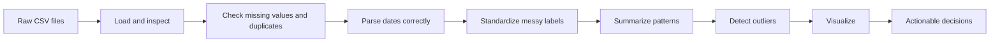
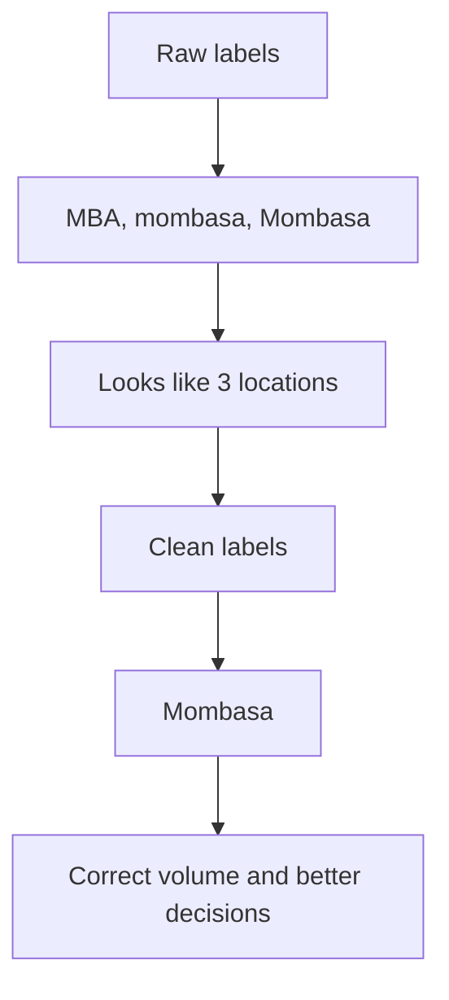

# Comprehensive Summary: Key Concepts and Insights from the Dataset Analysis

## Executive Summary

The notebook demonstrates a full data analysis workflow: load the data, inspect structure, clean inconsistent labels, summarize numerical patterns, detect outliers, visualize trends, and convert observations into decisions.

The most important lesson across both datasets is simple: **clean categories and correctly parsed timestamps come before serious interpretation**. If `MBA`, `mombasa`, and `Mombasa` are treated as different locations, or if `01/06/2026` is parsed as January 6 instead of June 1, the analysis becomes technically polished but operationally misleading.



## Key Concepts Explained

### 1. Data Loading

Loading data means reading the CSV into a table-like structure, usually a pandas DataFrame.

**Why it matters:** The analyst first checks whether the dataset opened correctly, whether columns are present, and whether values look reasonable.

**Fun gist:** This is opening the data suitcase before the trip. You do not want to reach the airport and discover you packed only socks.

### 2. Data Profiling

Profiling answers quick questions:

- How many rows and columns are there?
- What are the data types?
- What is the time range?
- Are there duplicates?
- What are the basic statistics?

**Why it matters:** Profiling prevents blind analysis. It tells us whether we are analyzing a small sample, a full operational log, a clean dataset, or a messy one wearing a neat shirt.

### 3. Missing Value Checks

Both datasets have no missing values in the analyzed columns.

**Why it matters:** Missing values can distort averages, counts, and charts. Even when none exist, checking is still part of good analytical hygiene.

### 4. Timestamp Parsing

The current CSV files use date strings like `01/06/2026 00:00`. This is ambiguous unless the format is specified.

For the sensor dataset, the intended range is:

- Start: `2026-06-01 00:00:00`
- End: `2026-06-07 22:35:00`

The safe parsing approach is:

```python
pd.to_datetime(df["timestamp"], dayfirst=True)
```

**Critical analysis:** The notebook uses `pd.to_datetime()` in its cells. With the current CSV date format, analysts should explicitly use `dayfirst=True` or a fixed format such as `format="%d/%m/%Y %H:%M"`. Otherwise, early dates can be interpreted incorrectly.

### 5. Category Standardization

Both datasets intentionally contain inconsistent labels.

Sensor examples:

- `Mombasa`, `mombasa`, and `MBA` should be treated as `Mombasa`.
- `Nairobi` and `NRB` should be treated as `Nairobi`.
- `Pressure_01` and `P1` should be treated as one sensor.
- `temp_sensor` and `TEMP_SENS` should be treated as one sensor.

Hospital examples:

- `Emergency`, `ER`, and `emergency` should be treated as `Emergency`.
- `Pediatrics` and `Peds` should be treated as `Pediatrics`.
- `General Ward` and `GW` should be treated as `General Ward`.
- `urgent` and `URGENT` should be standardized as `Urgent`.

**Why it matters:** Messy categories split one real-world group into several fake groups. This can make volume, averages, and staffing decisions wrong.

### 6. Outlier Detection

The notebook uses the IQR method:

```text
IQR = Q3 - Q1
Lower fence = Q1 - 1.5 * IQR
Upper fence = Q3 + 1.5 * IQR
```

**Why it matters:** Outliers can reveal real incidents, equipment faults, data entry mistakes, or unusual operational conditions.

**Important:** Outliers should be flagged and investigated, not automatically deleted.

## Dataset 1: Sensor Readings

### Dataset Snapshot

| Metric | Value |
|---|---:|
| Rows | 2,000 |
| Columns | 5 raw columns |
| Correct time span | 2026-06-01 00:00 to 2026-06-07 22:35 |
| Mean reading | 50.45 |
| Median reading | 50.45 |
| Standard deviation | 9.88 |
| Minimum reading | 17.59 |
| Maximum reading | 88.53 |
| IQR outliers | 17 |

### Visual Summary


### Cleaned Category Counts

| Cleaned location | Records |
|---|---:|
| Mombasa | 1,005 |
| Nairobi | 654 |
| Kisumu | 341 |

| Cleaned sensor | Records |
|---|---:|
| temp_sensor | 1,033 |
| Pressure_01 | 967 |

### Shift-Level Findings

| Shift | Records | Mean reading | Median reading |
|---|---:|---:|---:|
| Afternoon | 632 | 49.90 | 49.84 |
| Morning | 639 | 51.03 | 51.15 |
| Night | 729 | 50.42 | 50.13 |

### Critical Analysis

The sensor readings are centered around 50, which matches the generated normal distribution. Morning has a slightly higher average reading than Afternoon and Night, but the difference is small. This should not be treated as a major operational issue without further statistical testing or domain thresholds.

Mombasa dominates the dataset after cleaning, with more than half of the records. Without standardization, Mombasa would be fragmented into three labels and its true record volume would be hidden.

The 17 outliers are not automatically bad data. In a real industrial setting, high or low pressure and temperature readings may indicate real equipment stress, calibration drift, or environmental changes.

### Actionable Insights

1. Create a sensor and location lookup table so aliases are standardized at ingestion.
2. Add automated timestamp validation using the expected date format.
3. Flag readings below `24.19` or above `76.41` for review.
4. Build monitoring dashboards by cleaned location, cleaned sensor, and shift.
5. Investigate whether Morning readings are consistently higher over multiple weeks before changing operations.

## Dataset 2: Hospital Wait Times

### Dataset Snapshot

| Metric | Value |
|---|---:|
| Rows | 3,000 |
| Columns | 6 raw columns |
| Correct time span | 2026-01-01 00:10 to 2026-01-30 23:17 |
| Mean wait time | 45.61 minutes |
| Median wait time | 45.44 minutes |
| Standard deviation | 15.51 minutes |
| Minimum wait time | -13.80 minutes |
| Maximum wait time | 108.91 minutes |
| Negative wait times | 5 |
| IQR outliers | 22 |

### Visual Summary


### Cleaned Category Counts

| Cleaned ward | Records |
|---|---:|
| Emergency | 1,285 |
| General Ward | 864 |
| Pediatrics | 851 |

| Cleaned priority | Records |
|---|---:|
| Urgent | 1,219 |
| Medium | 613 |
| High | 597 |
| Low | 571 |

### Wait Time by Ward

| Ward | Records | Mean wait | Median wait |
|---|---:|---:|---:|
| Emergency | 1,285 | 45.65 | 45.42 |
| General Ward | 864 | 44.81 | 44.54 |
| Pediatrics | 851 | 46.37 | 46.59 |

### Wait Time by Priority

| Priority | Records | Mean wait | Median wait |
|---|---:|---:|---:|
| High | 597 | 45.49 | 46.08 |
| Low | 571 | 46.34 | 46.55 |
| Medium | 613 | 44.93 | 44.51 |
| Urgent | 1,219 | 45.67 | 44.97 |

### Wait Time by Nurse

| Nurse | Records | Mean wait | Median wait |
|---|---:|---:|---:|
| Nurse_Joy | 768 | 45.90 | 45.49 |
| Nurse_Ratched | 781 | 45.27 | 44.84 |
| Staff_A | 713 | 46.30 | 47.14 |
| Staff_B | 738 | 45.01 | 45.41 |

### Critical Analysis

The average hospital wait time is about 46 minutes, with a fairly wide spread. The presence of 5 negative wait times is a clear data quality issue because patients cannot wait negative minutes. Those records likely come from timestamp errors, formula errors, or synthetic noise.

Priority categories do not show a strong operational difference in wait time. In real hospital triage, urgent cases should normally move faster than low-priority cases. Here, `Urgent`, `High`, `Medium`, and `Low` have very similar average waits. That suggests one of three things:

1. The data is synthetic and not designed to reflect triage logic.
2. Priority labels are not being used to influence queue order.
3. The captured wait-time metric does not represent the part of the workflow affected by priority.

Nurse-level differences are small. Staff_A has the highest average wait, but this should not be interpreted as individual performance without controlling for ward, priority, hour, and patient volume.

### Actionable Insights

1. Treat negative wait times as data quality exceptions and investigate the source.
2. Standardize ward and priority labels before reporting hospital performance.
3. Monitor urgent-case wait time separately and define a service target.
4. Compare nurse-level metrics only after adjusting for patient mix and shift workload.
5. Track hourly wait trends to identify staffing gaps or bottlenecks.
6. Create a queue performance dashboard with median wait, 90th percentile wait, urgent-case wait, and negative-time exceptions.

## Cross-Dataset Lessons

### Lesson 1: Clean Labels Change the Story



### Lesson 2: Averages Need Context

The mean is helpful, but it can hide variation. That is why the notebook also checks medians, standard deviations, distributions, and outliers.

### Lesson 3: Outliers Are Investigation Tickets

Outliers are not always mistakes. They are signals. In sensors, they may indicate equipment issues. In hospitals, they may indicate unusually long waits or impossible values like negative waiting time.

### Lesson 4: Visuals Make Quality Problems Obvious

Charts quickly show:

- Whether numeric values are centered or skewed.
- Whether category labels are fragmented.
- Whether time-based patterns exist.
- Whether outliers deserve attention.

## Recommended Next Steps

| Priority | Recommendation | Why it matters |
|---|---|---|
| High | Fix timestamp parsing in the notebook using `dayfirst=True` or a fixed format | Prevents incorrect time-series conclusions |
| High | Add cleaning dictionaries for locations, sensors, wards, and priorities | Prevents fake category fragmentation |
| High | Create exception reports for outliers and negative wait times | Supports operational review |
| Medium | Add percentiles such as P75, P90, and P95 | Better for service-level reporting than averages alone |
| Medium | Build repeatable dashboards from cleaned fields | Enables consistent reporting |
| Medium | Separate synthetic-data findings from real-world operational claims | Avoids over-interpreting generated data |

## Final Analyst Takeaway

The notebook teaches a strong end-to-end analysis pattern: inspect first, clean second, summarize third, visualize fourth, and recommend last. The biggest real-world value is not just calculating averages. It is noticing where the data could mislead people and building guardrails so decisions are based on clean, correctly interpreted information.

